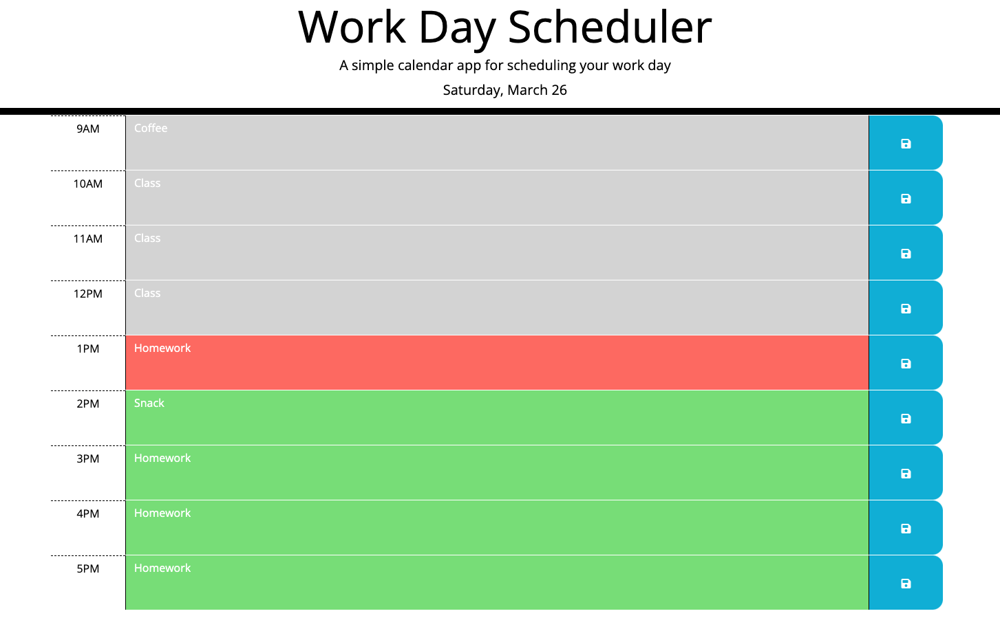

# work-day-scheduler
An employee with a busy schedule wants to add important events to a daily planner so that they can manage my time effectively.

# Description of Work
1. When the user opens the planner, the current day is displayed at the top of the calendar.
2. When the user scrolls down, then they are presented with timeblocks for standard business hours.
3. When they view the timeblocks for that day, then each timeblock is color coded to indicate whether it is in the past, present, or future.
4. When the user clicks into a timeblock, then they can enter an event.
5. When they click the save button for that timeblock, then the text for that event is saved in local storage.
6. When they refresh the page, then the saved events persist.

# Screenshot of Browser

# Link to Deployed Page
https://jooreea.github.io/work-day-scheduler/